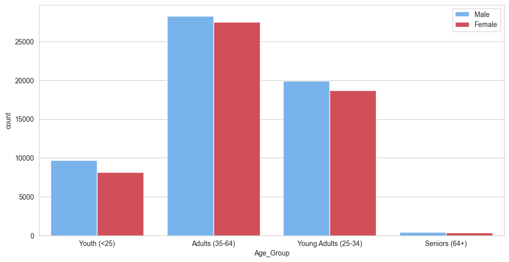
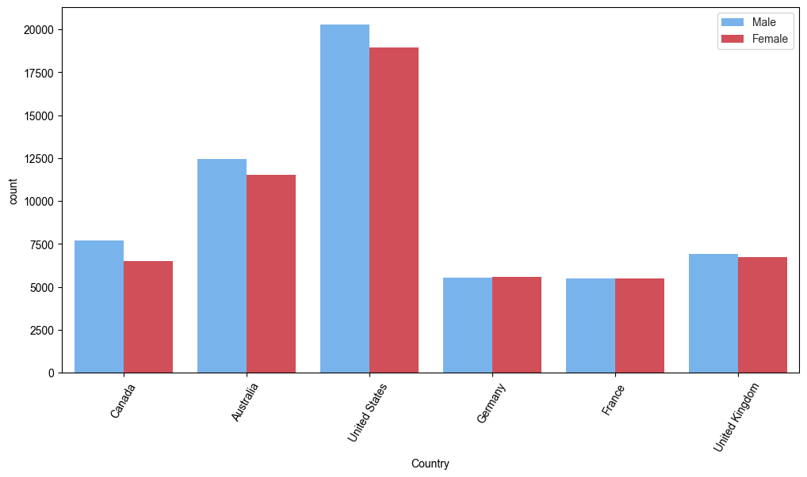
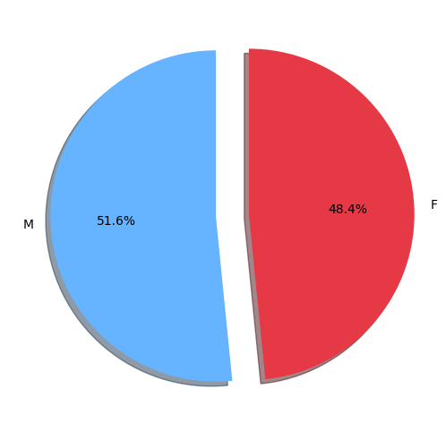
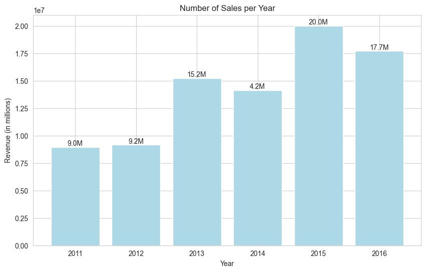

# European Bike Sales

This project focuses on utilizing advanced machine learning techniques to accurately predict the unit prices of bicycles based on a wide range of features. The dataset utilized for this project can be acquired from Kaggle.

## Table of Contents
- [European Bike Sales](#european-bike-sales)
  - [Table of Contents](#table-of-contents)
  - [Requirements](#requirements)
  - [Usage](#usage)
  - [Dataset](#dataset)
  - [Analysis](#analysis)
    - [Data Cleaning](#data-cleaning)
    - [Exploratory Data Analysis](#exploratory-data-analysis)
    - [Machine Learning](#machine-learning)
  - [Conclusion](#conclusion)
  - [License](#license)
## Requirements
To effectively run this project, the following libraries are essential:
- pandas
- numpy
- matplotlib
- seaborn
- scikit-learn

You can effortlessly install these libraries using the provided command:
```bash
pip install pandas numpy matplotlib seaborn scikit-learn
```

## Usage 
To execute this project successfully, follow the step-by-step instructions below:

1. Clone the repository to your local machine:
```bash
git clone https://github.com/abneribeiro/european-bike-sales.git
```

2. Navigate to the project directory:
```bash
cd european-bike-sales
```

3. Launch the Jupyter notebook:
```bash
jupyter notebook
```

4. Run the notebook cells to observe the comprehensive analysis results.

## Dataset 
The dataset used in this project encompasses crucial information concerning bicycle sales throughout Europe. It includes the following essential features:

| Feature        | Description           |
| ------------- |-------------|
| Day      | The day of the transaction |
| Year      | The year of the transaction      |
| Customer_Age | The age of the customer     |
| Order_Quantity | The quantity of bicycles ordered     |
| Unit_Cost | The unit cost of the bicycle     |
| Profit | The profit generated from the sale     |
| Cost | The cost of the bicycles     |
| Revenue | The total revenue from the sale     |

The primary objective of this project is to leverage these features to accurately predict the unit prices of bicycles.

## Analysis
The analysis is divided into several key sections:

### Data Cleaning 

To ensure data reliability and consistency, a meticulous data cleaning process was carried out on the European bike sales dataset. The following key steps were performed during this phase:

1. **Missing Values Verification**: All fields in the dataset, comprising a total of **113,036 records**, were checked for missing values. It was determined that no missing values were present, eliminating the need for data imputation or removal procedures.

2. **Duplicate Detection**: A thorough examination was conducted to identify and handle any potential duplicate records. Fortunately, no duplications were found, indicating that no further action was required to remove duplicate entries.

3. **Data Type Correction**: During the analysis, it was observed that some columns required adjustments to their data types to ensure proper representation and compatibility. For instance, the "Date" column was initially stored as a string but was converted to the **datetime64[ns]** format for better handling and analysis. This conversion enabled more effective utilization of the temporal information contained within the column.

4. **Value Validation**: The values in various columns were validated to ensure they corresponded to the expected categories and fell within acceptable ranges. The validation process ensured the consistency and conformity of the values in these columns with their respective predefined categories.

Following the completion of these data cleaning steps, the dataset was prepared for Exploratory Data Analysis (EDA

) to extract meaningful insights about bike sales in Europe.

### Exploratory Data Analysis 

During the Exploratory Data Analysis (EDA) phase, various visualizations and statistical measures were employed to gain insights into the dataset and understand the relationships between different features and the target variable.

Some of the key findings from the EDA include:

- The age group of Young Adults (25-34) tends to generate higher profit compared to other age groups, with a median profit of 113.0. On the other hand, the age group of Seniors (64+) has the lowest median profit of 76.5, suggesting lower purchasing power or engagement in fewer high-profit transactions.
    

- The sales volume is highest among the Adults (35-64) age group, with men generating a greater number of sales compared to women within this group. This indicates the influence of gender on sales generation within the adult group.
  
    

- The United States exhibits the highest sales rate, indicating significant market demand and consumer interest in this region. This highlights the importance of targeting the US market for bicycle sales.
  
    

- There is a gender disparity in bicycle purchases, with a higher proportion of men compared to women. This suggests the need for targeted marketing strategies and product offerings to address the preferences and needs of female customers.
  
    

- Sales have shown growth over the years, with the year 2015 recording the highest number of sales. This information can guide decision-making processes and inform business strategies to maximize revenue.
  
    

### Machine Learning 

In this project, a Decision Tree Regression model was trained and evaluated to predict the unit price of bicycles. The model utilized the provided dataset and various features to make accurate predictions.

The results of the machine learning model are as follows:

- The accuracy of the model is 96.91%.
- The mean absolute error is 0.03.

These results indicate that the model performs well in predicting the unit price of bicycles based on the provided variables.

## Conclusion

In this project, we have successfully developed a machine learning model to predict the unit price of bicycles based on a wide range of features. The model demonstrated high accuracy and low error, indicating its reliability and effectiveness in pricing bicycles.

This project provides valuable insights into the factors influencing bicycle prices and can assist businesses in making informed decisions regarding pricing strategies and revenue optimization.

## License

This project is licensed under the MIT License.
